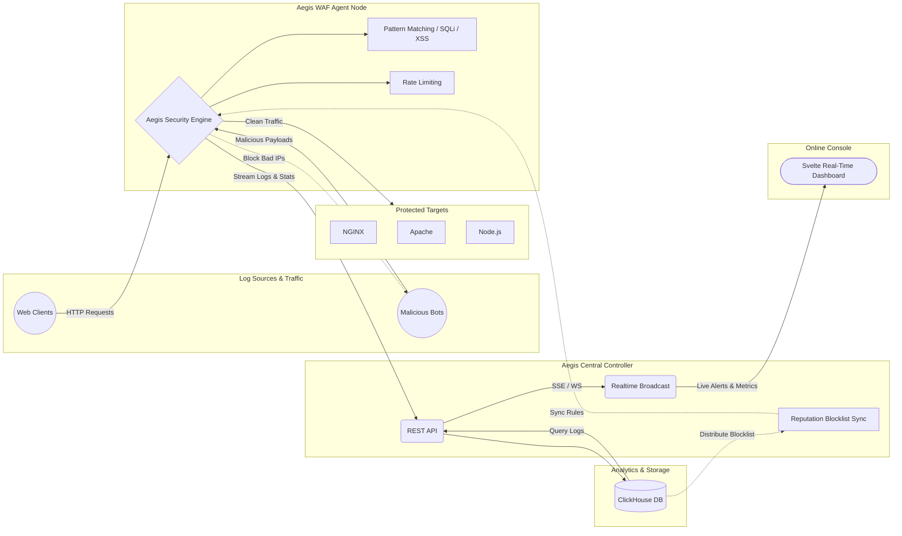

# 🛡️ Aegis WAF (Web Application Firewall)

Aegis WAF adalah project *Proof of Concept* (PoC) Web Application Firewall modern yang dibangun menggunakan **Rust** (Backend Proxy & Controller) dan **Svelte** (Frontend Dashboard).

Project ini dirancang sebagai WAF *reverse proxy* yang ringan, berkecepatan tinggi, dan mampu menyajikan log penyerangan secara *real-time* dengan visualisasi yang futuristik. 

## 🏗️ Architecture Diagram



## ✨ Pros (Kelebihan & Keunggulan)

- **High-Performance Rust Proxy**: Menggunakan `tokio`, `axum`, dan `hyper`. Proxy didesain secara asinkron (async) tanpa proses blocking pada *hot path*, sehingga overhead latensi analisis WAF sangat kecil.
- **Enterprise-Ready Database (ClickHouse)**: Kini Aegis beralih sepenuhnya ke **ClickHouse**. Semua *log* dan *metrics* disiram melalui *batching* (`JSONEachRow`) ke arsitektur analitik terdistribusi, menghilangkan *bottleneck* I/O pada SQLite.
- **Real-Time Data Streaming**: Dashboard menggunakan Svelte Stores dan `Server-Sent Events (SSE)`. Log penyerangan akan dirender secara hardware-accelerated di UI melalui `@xterm/xterm` tanpa menyebabkan *freeze* pada browser meskipun pada saat terjadi DDoS.
- **Modern & Beautiful UI**: Antarmuka dashboard didesain seperti terminal pengawasan (NOC) yang dilengkapi peta lalu-lintas jaringan (SVG Attack Map), Svelte stores reactivity, dan animasi micro-interactions.
- **Reputation Blocklist Engine**: Mendeteksi IP nakal yang melebihi limit blokir secara konstan dan mem- *ban* IP tersebut di seluruh node Agent WAF.

---

## ⚠️ Cons & Limitations (Kekurangan Secara Jujur)

Walaupun tampilan terlihat canggih, mohon diperhatikan bahwa project ini **belum sepenuhnya siap untuk production** dan masih memiliki banyak *mockup* serta keterbatasan teknis:

1. **Dashboard Rate Limiting Hanya Mockup**: 
   UI konfigurasi *Rate Limiting Tiers* (Default, Auth, WebDAV, dll) saat ini **100% hardcoded (palsu)**. Backend Rust baru mendukung *Rate Limiting* sederhana berupa batas RPM (*Requests Per Minute*) global atau per *virtual host*. Tidak ada penyimpanan tier di database.
   
2. **Metrik Node Agent Adalah Simulasi (Palsu)**: 
   Panel "WAF Node Agent Diagnostics" di dashboard yang menampilkan informasi penggunaan CPU, RAM, Disk, dan Uptime saat ini hanya **menggunakan fungsi matematika `Math.random()` di Svelte**. Belum ada integrasi eBPF atau `sysinfo` untuk mengukur *hardware usage* secara nyata.

3. **Tidak Ada Sinkronisasi Real-Time Config (Gossip Protocol)**:
   Ketika rule atau blocklist diubah via UI, controller saat ini menyebar IP Blocklist, namun belum mendukung penyebaran Custom Rules atau sertifikat SSL secara dinamis tanpa *restart* Agent.

---

## Kesimpulan

Aegis WAF adalah landasan / prototipe yang **sangat bagus** secara arsitektur dasar. Performa Rust Proxy ditambah skalabilitas basis data ClickHouse dan reaktivitas Svelte UI menyajikan _User Experience_ yang luar biasa cepat. 

**Next Steps yang dibutuhkan (Roadmap):**
- **eBPF Integration**: Menanamkan probe eBPF (XDP) untuk mem- *drop* koneksi pada level kernel sehingga konsumsi CPU server target mendekati 0% saat DDoS (Phase 5).
- Mengganti simulasi *hardware metrics* dengan metrik sungguhan.
- Membuat Endpoint API untuk mengatur *Rate Limiting Tiers* yang kompleks.

---

## 🚀 Tata Cara Instalasi

Aegis WAF terbagi menjadi dua komponen utama: **Central Controller** (sebagai otak & penyimpan log) dan **Agent Node** (sebagai shield yang dipasang di server target).

### 1. Menjalankan Central Controller & Dashboard (Windows / Linux / macOS)
Sangat direkomendasikan menjalankan Controller menggunakan **Docker Desktop** (Windows/Mac) atau **Docker Engine** (Linux) karena sudah me-*bundling* ClickHouse Database.

```bash
# 1. Masuk ke direktori aegis-waf
cd aegis-waf

# 2. Nyalakan Controller, Dashboard UI, dan ClickHouse dalam 1x perintah
docker-compose up -d --build
```
*Akses Dashboard WAF di Browser: `http://localhost:8080`*

### 2. Memasang Agent Node di Target Server (Linux / macOS)
Gunakan *install script* yang di-_host_ oleh Controller Anda untuk mengonfigurasi Agent target:

```bash
# Ganti <CONTROLLER_IP> dengan IP Private/Public dari mesin Central Controller Anda
curl -sSL http://<CONTROLLER_IP>:8080/install.sh | CONTROLLER_IP=<CONTROLLER_IP>:8080 bash
```

*(Catatan PoC: Pada tahap pengembangan saat ini, Anda mungkin perlu melakukan `cargo build --release` secara manual di VM target jika rilis _binary_ belum dipublikasikan).*

---

## 💻 Perbedaan Fitur Berdasarkan Sistem Operasi

Kemampuan Agent Aegis WAF bervariasi bergantung pada sistem operasi dari Server Target yang dilindungi:

| Fitur / Kemampuan | 🐧 Linux (Ubuntu/Debian/dll) | 🍎 macOS | 🪟 Windows Server |
| :--- | :--- | :--- | :--- |
| **Reverse Proxy Engine** | ✅ Ya (Sangat Cepat via epoll) | ✅ Ya (via kqueue) | ✅ Ya (via IOCP) |
| **Pattern Matching (SQLi/XSS)** | ✅ Ya | ✅ Ya | ✅ Ya |
| **Background Service Daemon** | ✅ Ya (`systemd`) | ⚠️ Manual / `launchd` | ✅ Ya (`install.ps1` via NSSM/SC) |
| **eBPF (Kernel Packet Drop)** | 🔥 **Ya** (Siap dikembangkan untuk XDP) | ❌ Tidak didukung Apple Kernel | ❌ Tidak didukung Windows Kernel |
| **Hardware Metrics Collection** | ✅ Mendalam (via `/proc`) | ⚠️ Terbatas | ⚠️ Terbatas (WMI overhead) |

### Mengapa Linux Paling Superior untuk WAF?
Linux sangat direkomendasikan sebagai mesin yang dipasangi **Aegis Agent** untuk di lingkungan produksi. Hal ini dikarenakan Linux mendukung **eBPF (Extended Berkeley Packet Filter)**. Dengan eBPF, Aegis dapat mendeteksi lalu lintas berbahaya (seperti serangan Volumetrik DDoS) dan **membuang (drop) paket tersebut langsung di level Kernel (NIC)** sebelum paket tersebut membebani memori, TCP Stack, atau CPU server web Anda. Hal ini membuat CPU server target tetap stabil mendekati 0% di tengah pusaran serangan.
