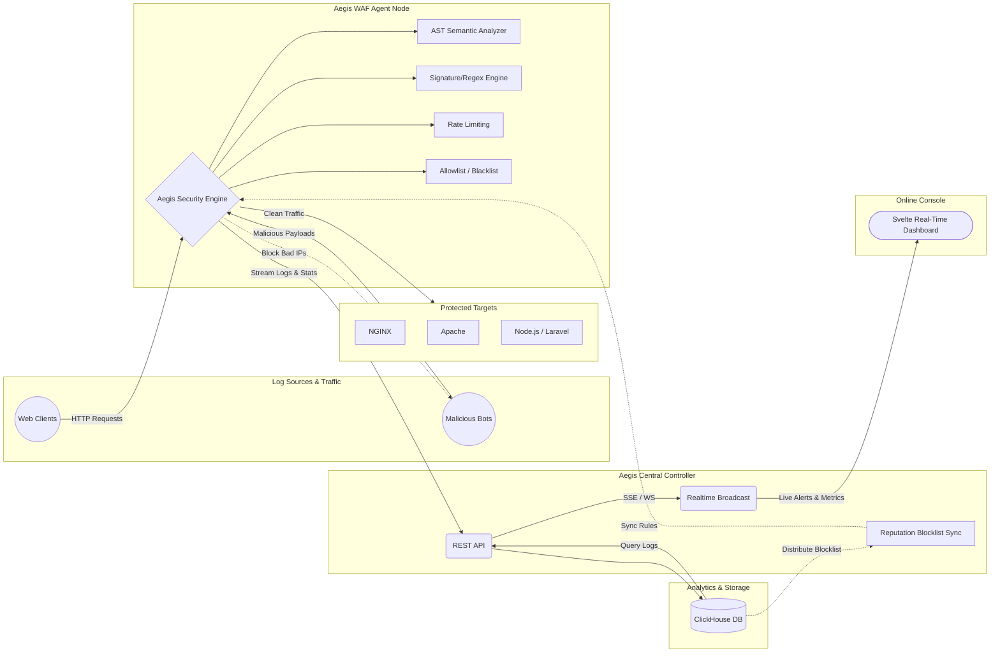

# 🛡️ Aegis WAF (Web Application Firewall)

Aegis WAF is a modern, high-performance **Web Application Firewall** built with **Rust** (backend proxy & controller) and **Svelte** (frontend dashboard). It functions as a reverse proxy that inspects, filters, and logs HTTP traffic in real-time with a futuristic monitoring UI.

---

## 📑 Table of Contents

- [Architecture](#-architecture-diagram)
- [Features](#-features)
- [Requirements](#-system-requirements)
- [Quick Start (Zero-to-Run)](#-quick-start-zero-to-run)
  - [Option A: Automated Setup (Ubuntu/Debian)](#option-a-automated-setup-recommended)
  - [Option B: Docker-Only Deployment](#option-b-docker-only-deployment)
  - [Option C: Manual Setup (Any OS)](#option-c-manual-setup-any-os)
  - [Option D: Standalone Agent Deployment (Lightweight VPS)](#option-d-standalone-agent-deployment-lightweight-vps)
- [Development Mode](#-development-mode)
- [Port & Service Discovery](#-port--service-discovery)
- [Manager Script Reference](#-manager-script-reference)
- [Project Structure](#-project-structure)
- [Cross-Platform Deployment Matrix](#-cross-platform-deployment-matrix)
- [DevSecOps & CI/CD](#-devsecops--cicd)
- [WAF Rules & Security Engine](#-waf-rules--security-engine)
- [Limitations](#-known-limitations)
- [Roadmap](#-roadmap)

---

## 🏗️ Architecture Diagram



---

## ✨ Features

| Category | Feature |
|---|---|
| **Performance** | Async Rust proxy (tokio + axum + hyper), pooled HTTP connections, zero-copy forwarding |
| **Detection Engine** | Dual-layer: AST Semantic Tokenizer (`SQLI-AST`, `XSS-AST`) + Signature-based Regex |
| **Normalization** | Recursive URL decode, HTML entity decode, NFKC Unicode normalization |
| **Access Control** | Allowlist & Blacklist per VHost (IP, CIDR, path-based) |
| **Rate Limiting** | Per-VHost RPM limiting with configurable tiers |
| **TLS** | Auto-provisioned Local CA certificates, custom cert upload |
| **Logging** | Async ClickHouse pipeline with <10ms latency, batched `JSONEachRow` inserts |
| **Dashboard** | Real-time Svelte UI with WebSocket streaming, xterm.js terminal, Globe attack map |
| **Reputation** | Cross-node IP reputation blocklist sync |
| **GeoBlocking** | MaxMind GeoIP-based country blocking per VHost |
| **eBPF (Linux)** | XDP kernel-level packet dropping for DDoS mitigation |

---

## 📋 System Requirements

### Minimum Hardware
| Resource | Minimum | Recommended |
|---|---|---|
| CPU | 1 core | 2+ cores |
| RAM | 1 GB | 2+ GB |
| Disk | 5 GB | 20+ GB (for ClickHouse logs) |

### Software Dependencies

| Dependency | Version | Purpose |
|---|---|---|
| **Rust** | >= 1.75.0 | Backend compilation |
| **Node.js** | >= 20.x | Dashboard build (Svelte/Vite) |
| **npm** | >= 10.x | Package management |
| **Docker** | >= 24.x | ClickHouse database & production deployment |
| **Docker Compose** | v2+ | Multi-service orchestration |
| **git** | >= 2.x | Repository cloning |
| **build-essential** | (any) | GCC, Make, pkg-config, libssl-dev |

> **Note**: On Ubuntu Server Minimal, none of these are pre-installed. The `manager.sh` script handles everything.

---

## 🚀 Quick Start (Zero-to-Run)

### Option A: Automated Setup (Recommended)

This is the **fastest way** to go from a fresh Ubuntu/Debian server to a running Aegis WAF.

```bash
# 1. Clone the repository
git clone https://github.com/Azhar457/aegis-waf.git
cd aegis-waf

# 2. Make the manager script executable
chmod +x manager.sh

# 3. Install ALL dependencies automatically
#    (Rust, Node.js 20, Docker, build-essential, etc.)
./manager.sh deps

# 4. IMPORTANT: Logout and login to apply Docker group changes
#    (Only needed if Docker was freshly installed)
exit
# SSH back in...

# 5. Deploy via Docker (Production Mode)
cd aegis-waf
./manager.sh install

# OR: Build from source and run in dev mode
./manager.sh build
./manager.sh dev
```

The `deps` command will automatically detect your OS and install:
- **Ubuntu/Debian**: `apt-get install build-essential pkg-config libssl-dev ...` + Rust via rustup + Node.js via NodeSource + Docker via official script
- **RHEL/CentOS/Fedora**: `dnf install gcc openssl-devel ...` + same toolchain setup
- **macOS**: `brew install openssl pkg-config ...` + same toolchain setup (Docker Desktop must be installed manually)

### Option B: Docker-Only Deployment

If you already have Docker installed and just want to run Aegis WAF without building from source:

```bash
# 1. Clone the repository
git clone https://github.com/Azhar457/aegis-waf.git
cd aegis-waf

# 2. Start everything (builds inside Docker containers)
docker compose up -d --build

# 3. Access the dashboard
#    Open: http://<YOUR_SERVER_IP>:8080
```

This uses the multi-stage `Dockerfile` which compiles Rust and builds Svelte inside containers. No local Rust or Node.js installation needed.

### Option C: Manual Setup (Any OS)

<details>
<summary>Click to expand manual installation steps</summary>

#### Step 1: Install Build Dependencies

**Ubuntu/Debian:**
```bash
sudo apt update
sudo apt install -y build-essential pkg-config libssl-dev curl wget git ca-certificates
```

**RHEL/CentOS/Fedora:**
```bash
sudo dnf install -y gcc gcc-c++ make pkgconfig openssl-devel curl wget git
```

**macOS:**
```bash
brew install openssl pkg-config curl git
```

#### Step 2: Install Rust

```bash
curl --proto '=https' --tlsv1.2 -sSf https://sh.rustup.rs | sh -s -- -y
source "$HOME/.cargo/env"
rustc --version  # Should show >= 1.75.0
```

#### Step 3: Install Node.js 20

```bash
# Ubuntu/Debian
curl -fsSL https://deb.nodesource.com/setup_20.x | sudo -E bash -
sudo apt install -y nodejs

# Verify
node --version  # Should show v20.x
npm --version   # Should show >= 10.x
```

#### Step 4: Install Docker

```bash
# Ubuntu/Debian/RHEL (official script)
curl -fsSL https://get.docker.com | sh
sudo usermod -aG docker $USER
sudo systemctl enable docker && sudo systemctl start docker

# Logout/login to apply group changes
exit
```

#### Step 5: Clone and Build

```bash
git clone https://github.com/Azhar457/aegis-waf.git
cd aegis-waf

# Install frontend dependencies
cd dashboard && npm install && cd ..

# Build everything
cargo build --release
cd dashboard && npm run build && cd ..
```

#### Step 6: Start Services

```bash
# Start ClickHouse
docker compose up -d clickhouse
sleep 5

# Set credentials
export CLICKHOUSE_USER=default
export CLICKHOUSE_PASSWORD=aegis

# Start Controller
./target/release/aegis-waf controller &

# Start Agent (separate terminal)
./target/release/aegis-waf agent --controller http://localhost:8080 &

# Access dashboard at http://localhost:8080
```

</details>

### Option D: Standalone Agent Deployment (Lightweight VPS)

For deploying the Aegis WAF Agent on a small VPS client (e.g., 1 Core, 2GB RAM) where running ClickHouse (~1GB RAM) and the Svelte Dashboard (~200MB RAM) is not feasible. This mode runs only the lightweight Rust proxy engine, which uses **~30MB of RAM**.

You can run the Agent in three logging modes:
- **`file` mode**: Writes security logs as JSON Lines to a local file with auto-rotation. Zero external database or controller dependencies.
- **`remote` mode**: Writes logs locally and pushes them asynchronously in batches to a central Aegis Controller.
- **`clickhouse` mode**: Standard mode, writes directly to ClickHouse (requires Docker).

#### Deployment Steps:

1. **Clone the repository on the client VPS**:
   ```bash
   git clone https://github.com/Azhar457/aegis-waf.git
   cd aegis-waf
   ```

2. **Install dependencies (only Docker is needed for container deployment)**:
   ```bash
   chmod +x manager.sh
   ./manager.sh deps
   ```

3. **Deploy the Agent via Docker Compose**:
   ```bash
   ./manager.sh agent-deploy
   ```
   *This starts only the lightweight `aegis-agent` container using [Dockerfile.agent](file:///d:/Desktop/KERJA/aegis-waf/Dockerfile.agent) and [docker-compose.agent.yml](file:///d:/Desktop/KERJA/aegis-waf/docker-compose.agent.yml), using [config.standalone.toml](file:///d:/Desktop/KERJA/aegis-waf/config.standalone.toml) as the config.*

4. **Verify the installation**:
   - Check container status: `docker ps` (should show `aegis_agent` running).
   - Check logs: `tail -f logs/aegis.log` (outside container) or `/var/log/aegis-waf/aegis.log` (inside container).

#### RAM Usage Comparison:

| Component | Full Stack (Option A/B) | Standalone Agent Only |
|---|---|---|
| Aegis Agent (Rust) | ~30 MB | ~30 MB |
| Aegis Controller (Rust) | ~50 MB | ❌ 0 MB |
| ClickHouse DB | ~800-1200 MB | ❌ 0 MB |
| Client App (Laravel/Node) | ~200 MB | ~200 MB |
| Client DB (MySQL) | ~300 MB | ~300 MB |
| **Available Free RAM** | **< 100 MB ⚠️** | **~1.4 GB ✅** |

---

## 💻 Development Mode

For local development with hot-reload:

**Linux / macOS:**
```bash
chmod +x manager.sh start.sh
./manager.sh dev
# OR
./start.sh
```

**Windows:**
```batch
start.bat
```

This starts 3 processes:
1. **ClickHouse** (Docker container)
2. **WAF Controller** (`cargo run -- controller`)
3. **WAF Agent** (`cargo run -- agent --controller http://localhost:8080`)
4. **Vite Dev Server** (`cd dashboard && npm run dev`)

| Service | URL |
|---|---|
| Dashboard UI (dev) | http://localhost:5173 |
| Controller API | http://localhost:8080 |
| ClickHouse HTTP | http://localhost:8123 |

---

## 🔌 Port & Service Discovery

### Default Port Mapping

| Port | Service | Protocol | Required |
|---|---|---|---|
| `8080` | Aegis Controller API + Dashboard | HTTP | ✅ Always |
| `8123` | ClickHouse HTTP Interface | HTTP | ✅ Always |
| `9000` | ClickHouse Native Interface | TCP | ⚪ Optional |
| `80` | WAF HTTP Proxy (Agent) | HTTP | ⚡ Production |
| `443` | WAF HTTPS Proxy (Agent) | HTTPS | ⚡ Production |
| `5173` | Vite Dev Server (Dashboard) | HTTP | 🔧 Dev only |

### Cross-Platform Deployment Combinations

Aegis WAF is designed as a **Controller + Agent** architecture. The Controller manages configuration, dashboard, and logs. Agents are reverse proxies deployed at target servers.

> ℹ️ The Controller and Agent can run on **different machines and different operating systems**.

#### Supported Combinations Matrix

| # | Controller OS | Agent OS | Status | Notes |
|---|---|---|---|---|
| 1 | 🐧 **Linux** | 🐧 **Linux** | ✅ **Full Support** | Best combo. Agent uses eBPF XDP for kernel-level DDoS protection. |
| 2 | 🐧 **Linux** | 🪟 **Windows** | ✅ Supported | Agent runs L7 proxy fallback. Use `start.bat` on Windows Agent. |
| 3 | 🐧 **Linux** | 🍎 **macOS** | ✅ Supported | Agent runs L7 proxy fallback. |
| 4 | 🪟 **Windows** | 🐧 **Linux** | ✅ Supported | Controller via Docker Desktop on Windows. Agent benefits from eBPF on Linux. |
| 5 | 🪟 **Windows** | 🪟 **Windows** | ✅ Supported | Both use L7 proxy mode. Docker Desktop required on Controller. |
| 6 | 🪟 **Windows** | 🍎 **macOS** | ✅ Supported | Both use L7 proxy mode. |
| 7 | 🍎 **macOS** | 🐧 **Linux** | ✅ Supported | Controller via Docker Desktop on macOS. Agent benefits from eBPF on Linux. |
| 8 | 🍎 **macOS** | 🪟 **Windows** | ✅ Supported | Both use L7 proxy mode. |
| 9 | 🍎 **macOS** | 🍎 **macOS** | ✅ Supported | Both use L7 proxy mode. |
| 10 | 🐳 **Docker** | 🐧 **Linux** | ✅ **Recommended** | Controller in Docker, Agent native on Linux with eBPF. |
| 11 | 🐳 **Docker** | 🪟 **Windows** | ✅ Supported | Controller in Docker (any host), Agent on Windows L7 proxy. |
| 12 | 🐳 **Docker** | 🍎 **macOS** | ✅ Supported | Controller in Docker (any host), Agent on macOS L7 proxy. |

#### How to Connect Agent to Remote Controller

```bash
# On the Agent machine:
./target/release/aegis-waf agent --controller http://<CONTROLLER_IP>:8080

# Windows Agent:
cargo run -- agent --controller http://<CONTROLLER_IP>:8080
```

#### eBPF Availability by OS

| OS | eBPF XDP | Fallback |
|---|---|---|
| Linux (Kernel ≥ 5.8) | ✅ Kernel-level packet drop | — |
| Linux (Kernel < 5.8) | ❌ | L7 Proxy (Axum) |
| Windows | ❌ N/A | L7 Proxy (Axum) |
| macOS | ❌ N/A | L7 Proxy (Axum) |

---

## 🛠️ Manager Script Reference

The `manager.sh` script is your single entry point for managing the entire Aegis WAF lifecycle.

### Interactive Mode
```bash
./manager.sh
# Displays a menu with all options
```

### Non-Interactive Commands

| Command | Description |
|---|---|
| `./manager.sh deps` | Install ALL dependencies (Rust, Node.js, Docker, build tools) |
| `./manager.sh build` | Build from source (Rust release + Svelte production) |
| `./manager.sh dev` | Start development mode (Controller + Agent + Vite) |
| `./manager.sh install` | Deploy via Docker (production) |
| `./manager.sh agent-deploy` | Deploy Agent-only via Docker (no ClickHouse, no Dashboard) |
| `./manager.sh agent-build` | Build Agent binary only (no dashboard build) |
| `./manager.sh upgrade` | Pull latest images and rebuild |
| `./manager.sh uninstall` | Remove Aegis WAF completely |
| `./manager.sh status` | Show system status and health checks |
| `./manager.sh logs` | Stream Docker container logs |
| `./manager.sh format` | Run Rust fmt, Clippy, tests + Svelte check |
| `./manager.sh help` | Show all available commands |

### Windows Equivalents

| Linux | Windows | Purpose |
|---|---|---|
| `./manager.sh dev` | `start.bat` | Start dev environment |
| `./manager.sh format` | `check.bat` | Run linters & formatters |

---

## 📁 Project Structure

```
aegis-waf/
├── src/                    # Rust backend source
│   ├── main.rs             # Entry point (Controller / Agent CLI)
│   ├── proxy.rs            # Reverse proxy engine (Axum)
│   └── rules.rs            # WAF rule engine (Regex + AST Semantic)
├── dashboard/              # Svelte frontend
│   ├── src/
│   │   ├── pages/          # Page components (Dashboard, VHost, AccessControl)
│   │   ├── components/     # Reusable UI components (Globe, Terminal, Charts)
│   │   └── App.svelte      # Root application
│   └── package.json
├── aegis-ebpf/             # eBPF XDP programs (Linux only)
├── certs/                  # Auto-generated TLS certificates
├── logs/                   # Runtime logs
├── config.toml             # WAF configuration
├── Dockerfile              # Multi-stage Docker build
├── docker-compose.yml      # Production deployment
├── manager.sh              # 🛡️ All-in-one management script
├── start.sh                # Unix dev launcher
├── start.bat               # Windows dev launcher
├── check.bat               # Windows lint/test tool
├── Cargo.toml              # Rust dependencies
└── .github/workflows/      # CI/CD pipelines
    └── devsecops.yml
```

---

## 🌐 Cross-Platform Deployment Matrix

### 🐧 Linux (eBPF XDP Enabled) — Production Recommended

On Linux (Kernel ≥ 5.8), Aegis WAF uses **eBPF XDP** to drop malicious packets at the kernel/NIC driver level before they reach userspace.

**Advantages:**
- Near-zero CPU overhead during volumetric DDoS
- Payload blocked before TCP/IP stack processing
- Proxy engine (Axum) only handles clean traffic

**Requirements:** Root access (`CAP_BPF` / `CAP_NET_ADMIN`)

### 🪟 Windows & 🍎 macOS (L7 Proxy Fallback)

On Windows/macOS, eBPF is unavailable. The WAF falls back to **Layer 7 application proxy** (Axum) for all blocking.

**Advantages:**
- Universal portability — works on any developer machine
- Full deep packet inspection, regex matching, rate limiting
- Easier to debug (no kernel-level complexity)

**Limitations:**
- Vulnerable to volumetric DDoS (all connections reach userspace)
- Higher CPU/RAM usage under heavy attack load

---

## 🛡️ DevSecOps & CI/CD

The project includes a comprehensive DevSecOps pipeline in [`.github/workflows/devsecops.yml`](.github/workflows/devsecops.yml):

### Static Analysis (SAST)
- **Rust**: `cargo fmt` + `cargo clippy` + `cargo audit` (CVE scanning)
- **Frontend**: `svelte-check` + `npm audit` + Prettier formatting
- **GitHub CodeQL**: Deep static analysis for SQLi, XSS, Command Injection, Path Traversal

### Dynamic Analysis (DAST)
- **OWASP ZAP**: Automated baseline scan against live Docker deployment

---

## 🔒 WAF Rules & Security Engine

Aegis WAF uses a **dual-layer detection engine**:

### Layer 1: AST Semantic Analyzer
- `SQLI-AST` — SQL injection detection via token-based semantic parsing
- `XSS-AST` — Cross-site scripting detection via HTML/JS tokenization

### Layer 2: Signature-Based Regex
- `SQLI-001` to `SQLI-00N` — Pattern-matched SQL injection signatures
- `XSS-001` to `XSS-00N` — Pattern-matched XSS payloads
- `LFI-001` — Local file inclusion patterns
- `RFI-001` — Remote file inclusion patterns
- `SSRF-001` — Server-side request forgery
- `CMDI-001` — OS command injection
- `BOT-001` — Bot/scanner detection (User-Agent based)

### Input Normalization Pipeline
```
Input → Recursive URL Decode → HTML Entity Decode → NFKC Unicode Normalize → Whitespace Cleanup → Engine
```

### Access Control
- **Allowlist**: Permit specific IPs/CIDRs to bypass WAF rules (useful for Laravel Telescope, admin panels, etc.)
- **Blacklist**: Block specific IPs/CIDRs permanently

Configurable per VHost via the Dashboard UI or `config.toml`.

---

## ⚠️ Known Limitations

1. **Rate Limiting Tiers**: UI shows configurable tiers, but backend only supports global RPM per VHost.
2. **Real-Time Metrics Push**: Agent telemetry (CPU/RAM/Disk) is collected but not auto-pushed to the dashboard.
3. **Config Sync**: Rule/cert changes via UI require Agent restart to take effect (no gossip protocol yet).
4. **eBPF**: Only available on Linux with Kernel ≥ 5.8 and root privileges.

---

## 🗺️ Roadmap

- [ ] eBPF XDP integration for kernel-level DDoS mitigation
- [ ] Real-time Agent metrics streaming to dashboard
- [ ] API-based Rate Limiting Tier management
- [ ] Gossip protocol for live config sync across Agents
- [ ] Pre-built binary releases (GitHub Actions)
- [ ] Helm chart for Kubernetes deployment

---

## 📄 License

This project is a Proof of Concept (PoC). See [SECURITY.md](SECURITY.md) for security policy.
